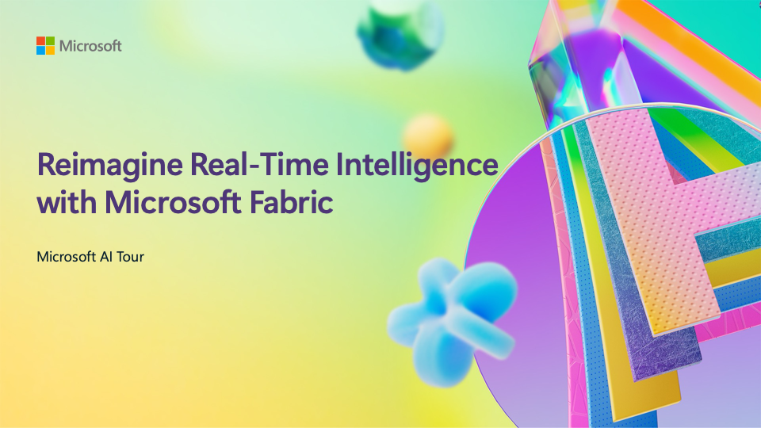

# Reimagine Real-Time Intelligence with Microsoft Fabric

This repo is a companion to this session at Microsoft AI Tour, a worldwide tour of events.

> Learn more about Microsoft AI Tour on the official website.

## Session Description

For many businesses, the ability to obtain meaningful insights from vast streams of data has been out of reach, until now. Join us for an exclusive session unveiling a new, redefining chapter of Real-Time Analytics. Whether you’re a business user, pro developer, or insights explorer, in this session you will discover how you can unleash the full potential of your high-volume streaming and event data and turn it into a competitive advantage.

## Learning Outcomes

- Learn to be proactive instead of reactive with your data, thanks to Real-Time Intelligence​
- Understand that no matter where their data live, Microsoft Fabric can get it ready for the world of AI​.
- Show that with Real-Time Intelligence customers can get insights as they happen, making their applications proactive.​
- Discover that RTI is for everyone by showing integrations with Microsoft Teams & Copilots.
- See that whether data lives outside Azure (on-prem, alt-clouds), or in OSS technologies, Fabric is ready to ingest data in real-time.

## Technology Used

- Microsoft Fabric
- Real-Time Intelligence
- Microsoft Teams
- Microsoft Copilot

## Additional Resources and Continued Learning

You can find additional resources, including the slides of the presentation, [here](./SESSION_RESOURCES.md).

If you will present this talk, you can find the [trainer resources here](./train-the-trainer/README.md).

## Content Owners

<!-- ALL-CONTRIBUTORS-LIST:START - Do not remove or modify this section -->

<table>
<tr>
    <td align="center"><a href="http://learnanalytics.microsoft.com">
         
        <b>Alvaro Videla Godoy
</b></a> 
            <a href="https://github.com/videlalvaro" title="talk">📢</a> 
    </td>
</tr></table>

<!-- ALL-CONTRIBUTORS-LIST:END -->

## Responsible AI 

Microsoft is committed to helping our customers use our AI products responsibly, sharing our learnings, and building trust-based partnerships through tools like Transparency Notes and Impact Assessments. Many of these resources can be found at [https://aka.ms/RAI](https://aka.ms/RAI).
Microsoft’s approach to responsible AI is grounded in our AI principles of fairness, reliability and safety, privacy and security, inclusiveness, transparency, and accountability.

Large-scale natural language, image, and speech models - like the ones used in this sample - can potentially behave in ways that are unfair, unreliable, or offensive, in turn causing harms. Please consult the [Azure OpenAI service Transparency note](https://learn.microsoft.com/legal/cognitive-services/openai/transparency-note?tabs=text) to be informed about risks and limitations.

The recommended approach to mitigating these risks is to include a safety system in your architecture that can detect and prevent harmful behavior. [Azure AI Content Safety](https://learn.microsoft.com/azure/ai-services/content-safety/overview) provides an independent layer of protection, able to detect harmful user-generated and AI-generated content in applications and services. Azure AI Content Safety includes text and image APIs that allow you to detect material that is harmful. We also have an interactive Content Safety Studio that allows you to view, explore and try out sample code for detecting harmful content across different modalities. The following [quickstart documentation](https://learn.microsoft.com/azure/ai-services/content-safety/quickstart-text?tabs=visual-studio%2Clinux&pivots=programming-language-rest) guides you through making requests to the service.

Another aspect to take into account is the overall application performance. With multi-modal and multi-models applications, we consider performance to mean that the system performs as you and your users expect, including not generating harmful outputs. It's important to assess the performance of your overall application using [generation quality and risk and safety metrics](https://learn.microsoft.com/azure/ai-studio/concepts/evaluation-metrics-built-in).

You can evaluate your AI application in your development environment using the [prompt flow SDK](https://microsoft.github.io/promptflow/index.html). Given either a test dataset or a target, your generative AI application generations are quantitatively measured with built-in evaluators or custom evaluators of your choice. To get started with the prompt flow sdk to evaluate your system, you can follow the [quickstart guide](https://learn.microsoft.com/azure/ai-studio/how-to/develop/flow-evaluate-sdk). Once you execute an evaluation run, you can [visualize the results in Azure AI Studio](https://learn.microsoft.com/azure/ai-studio/how-to/evaluate-flow-results).
