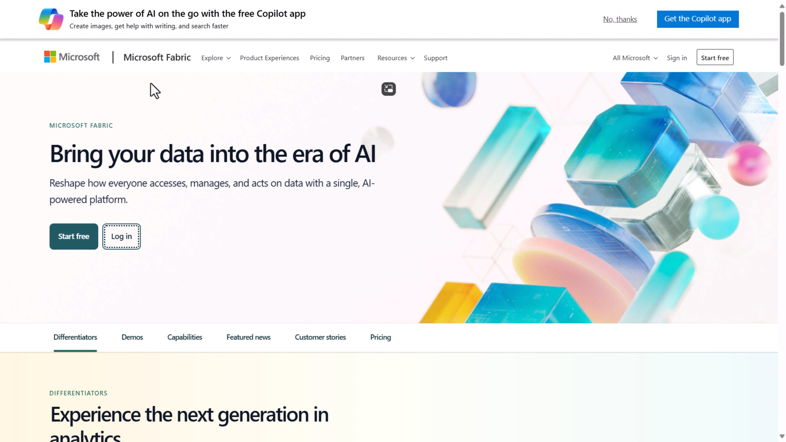
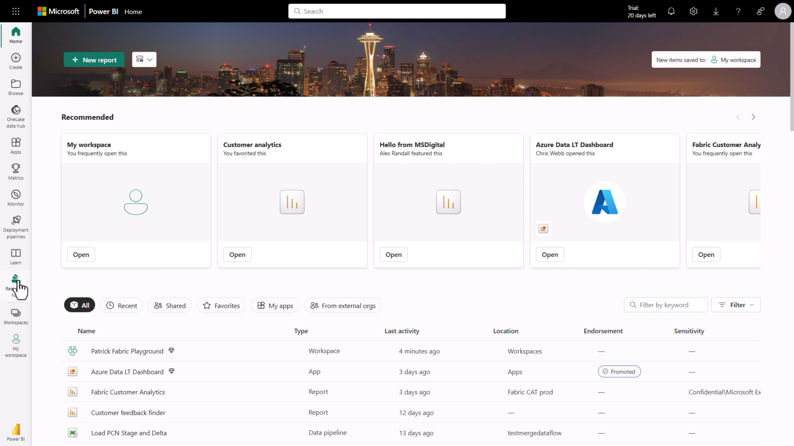
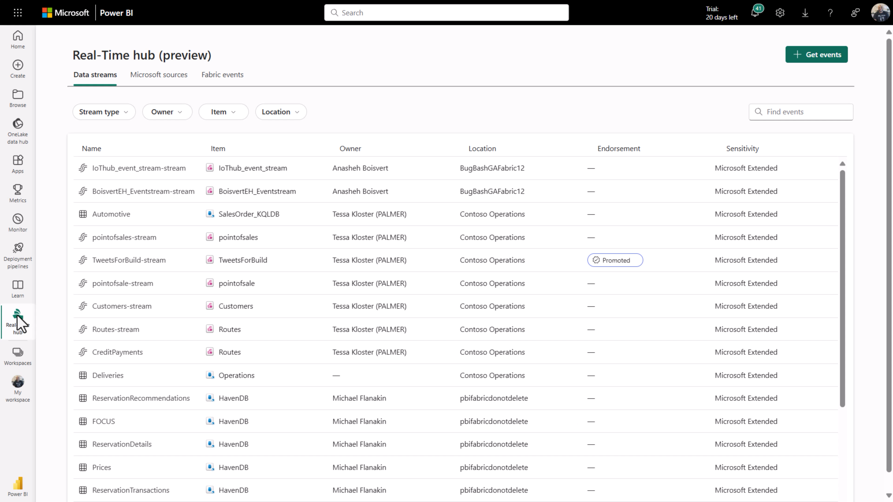
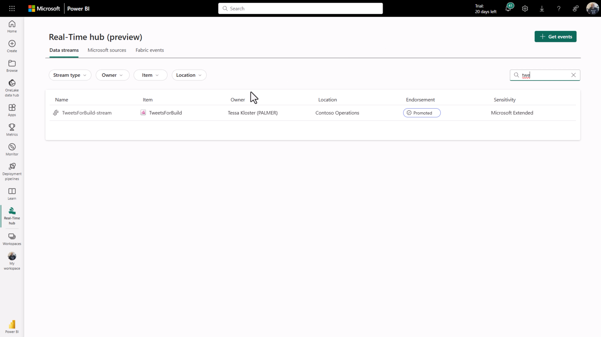
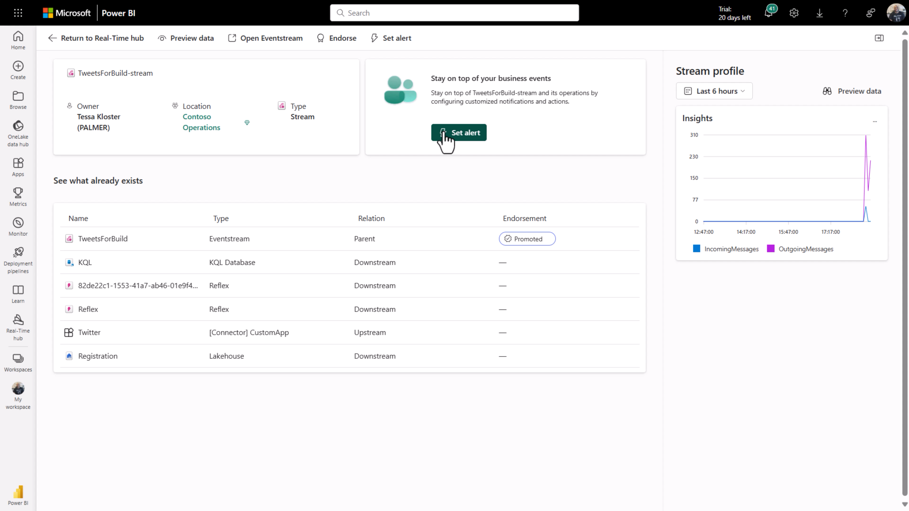
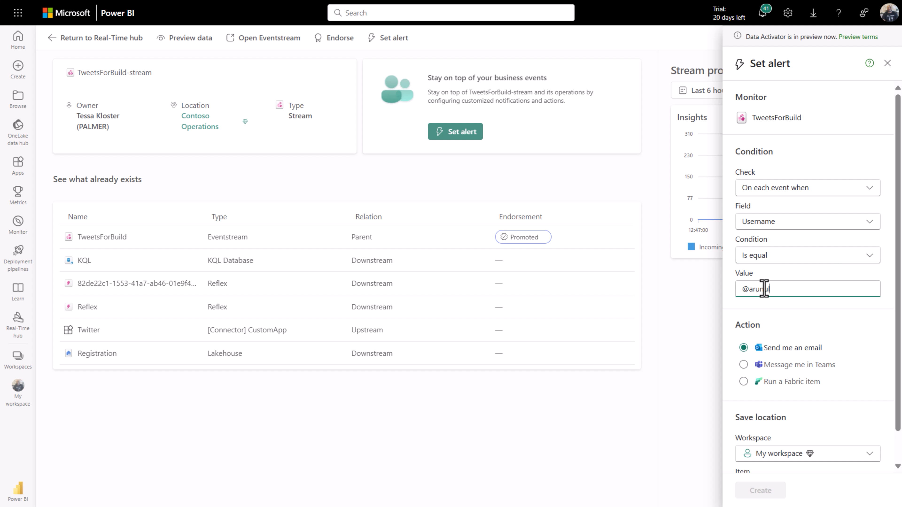
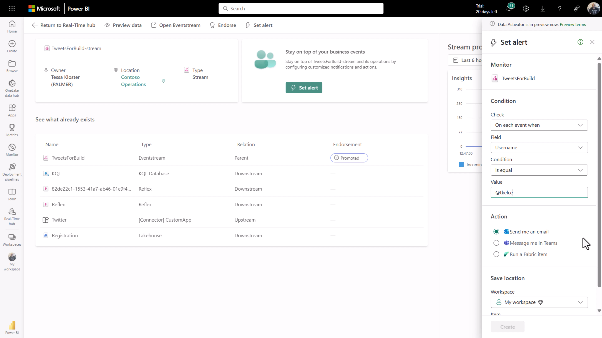
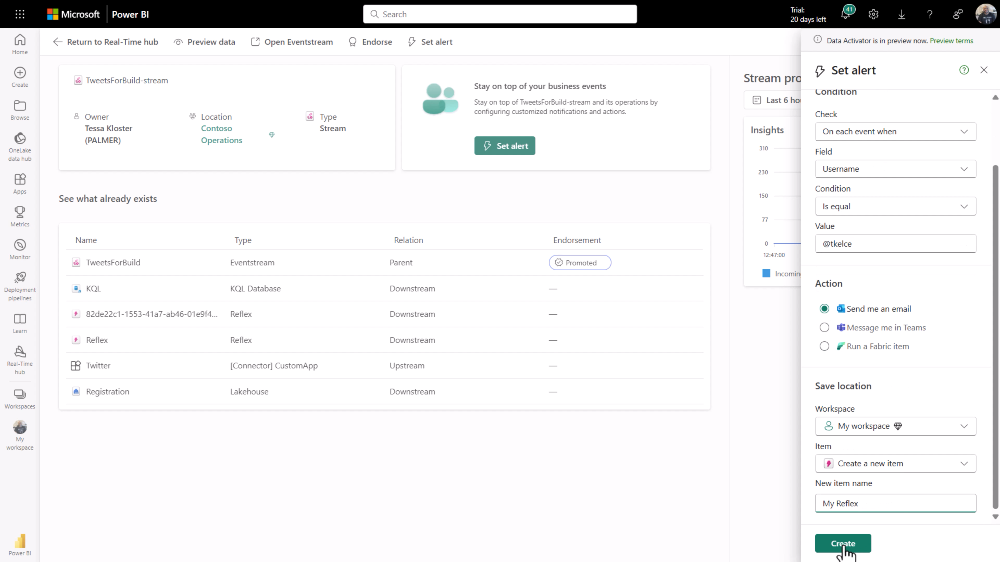

# Get started with real-time data DEMO

## Demo Intro

The idea is to show a quick demo that demonstrates how easy it is to get started with Real-Time Data in Fabric. Here's the scenario.

We have a feed that's tracking tweets about all the announcements around Real-Time Intelligence at Build, and we want to be notified whenever someone important retweets.

# ACCESS REAL-TIME HUB

The demo starts at [Microsoft.com/Fabric](Microsoft.com/Fabric).

We can find the Real-Time hub on the left-hand side.

# FIND DATA STREAM

Here you will see a list of items that live inside the Real-Time hub, like eventstreams, Eventhouse, and so on.

So we are going to filter these items by typing "tweet" in the search bar.

Once the filter is applied, we can see the tweet stream. We are going to select that one.

# CREATE TWEET FILTER – CHOOSE CELEBRITY NAME TO FILTER BY

Once we opened the stream, we can set an alert by clicking on the `SET ALERT` button.

What we are going to do is to create an alert that's going to send me an e-mail when someone important tweets.

The filter configured by setting up a _Condition_ like this:

    - `Check`: `On each event when`
    - `Field`: `Username`
    - `Condition`: `Is equal`
    - `Value`: `@tkelce`

With an action like this:

    - `Action`: `Send Email`

And in the `Save Location` we specify a `Workspace`, that we `create a new item`, and provide the new item name.

Then we'll try a couple of filter ideas until we find the right one.

First with @arunulag, but of course Arun is always tweeting about this kind of stuff [JOKE].

Or maybe @taylorswift13, but she's not really into Real-Time Intelligence [JOKE].

Let's use Travis Kelce. @tkelce.

He's the one that made Taylor Swift popular [JOKE]. 

Then we'll select "Create Alert" and that's it. 

You can choose whoever you want as a filter of course… 

# CONCLUSION

Now what I've done is that as soon as Travis Kelce tweets about Real-Time Intelligence. I'll get notified.
