# Ingest, analyze and act on real-time data

## Demo Intro

In this scenario, we am going to represent Contoso, a major retailer with data streaming from all point-of-sale systems around the world, which produces millions of signals that we want to understand as quickly as possible.

Since everything starts with data ingestion, this demo is going to show _Connectors_ and _Data Sources_, and how easy it is to bring in data from a wide range of sources into Real-Time Hub. In the demo, we are going to connect to Confluent Kafka, where the point-of-sale system data is streaming in from.

## SHOW REAL-TIME HUB

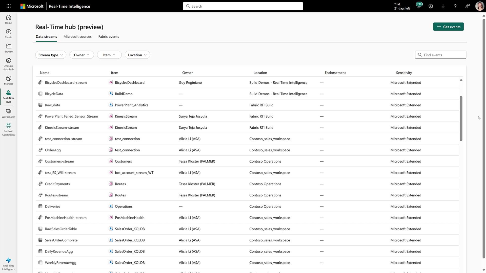

Back in the Real-Time hub, we can see a wide range of streams from across the whole organization. We can see information about where the stream is located, who's the owner, and whether or not it's endorsed.

Here we select the "Get events" button to start importing data.

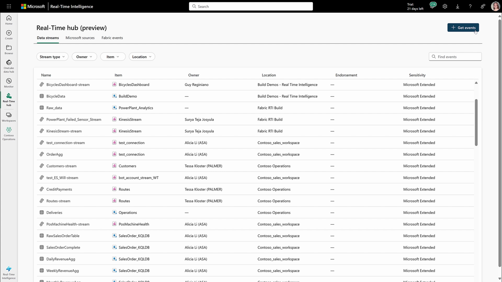

## SHOW CONNECTORS / DATA SOURCES

Of course, I can also leverage our wide range of connectors to bring in even more data. 

Whether my data is streaming from Amazon Kinesis, Google Pub/Sub, or in this case, I'm going to connect to Confluent Kafka, which is where my point-of-sale system data is streaming in from. 

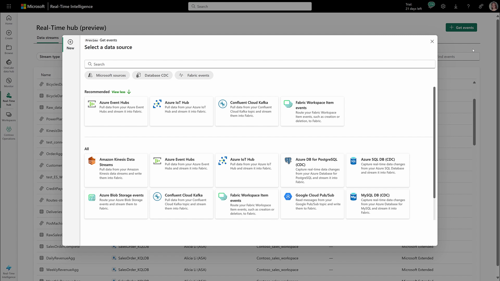

## CREATE CONNECTION

I'm going to create a quick connection and specify the information about the event stream, which is where we save it into. 

On the connectors page, select the Kafka connector.

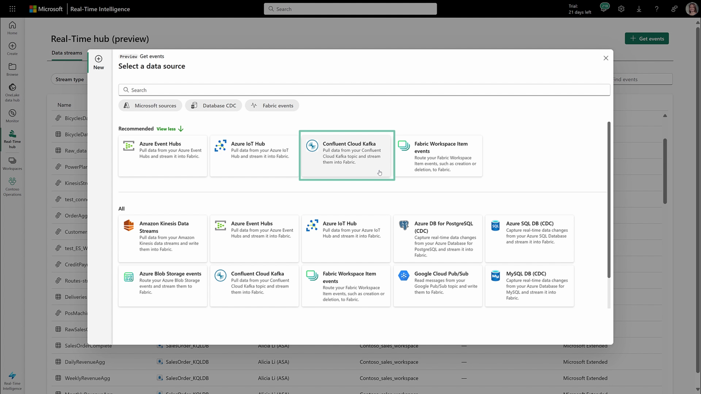

Then you will configure the connection. Specify a topic, a consumer group. Then select the Workspace the connection will be saved into, and provide an Eventstream name to start ingesting the data.

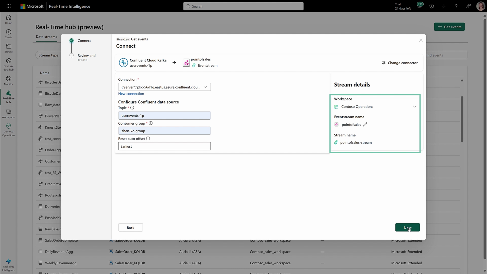

Just like that, it can create the connection, and now the data is coming into the Real-Time hub.

But also from this experience, I can open the event stream and actually transform and process the data a little bit more.

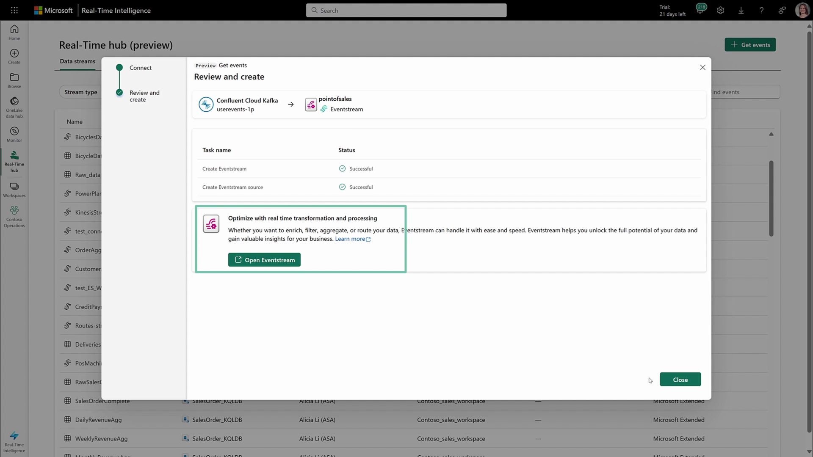

# STREAM EDITOR

In the event stream editor, I can see on the left-hand side, I have the source. 

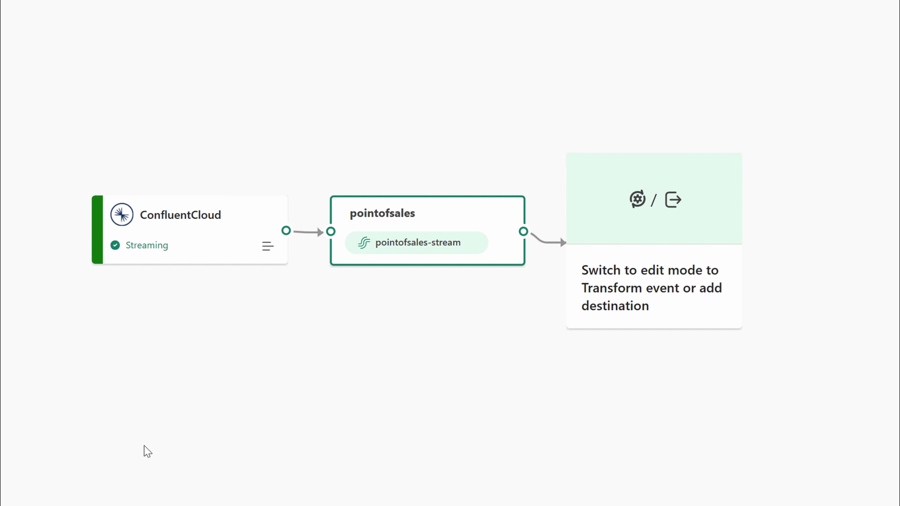

On the right-hand side, I have the transformations and the destinations that I can connect the stream to. 

You can see, I have a wide range of operations and destinations. 

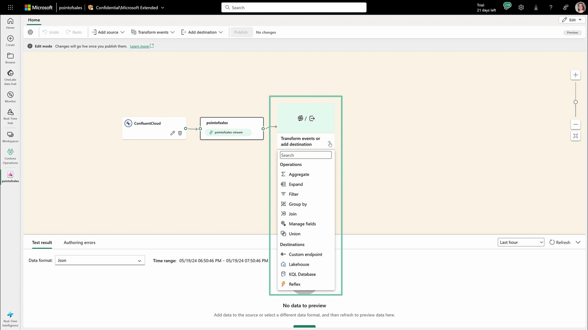

# LOAD DATA INTO EVENTHOUSE

Since I know I'm going to do further analytics on it, I'm going to load it directly into an Eventhouse in KQL database that's already within my organization, so the data is ready for me to do a little bit more. 

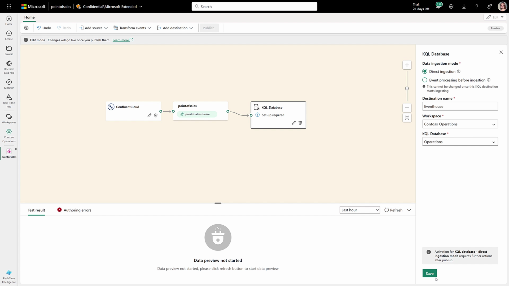

We can fast-forward ahead to something a little bit more complicated. 

# SHOW COMPLEX TRANSFORMATIONS

You could see some of the power, the ability to route to many destinations. 

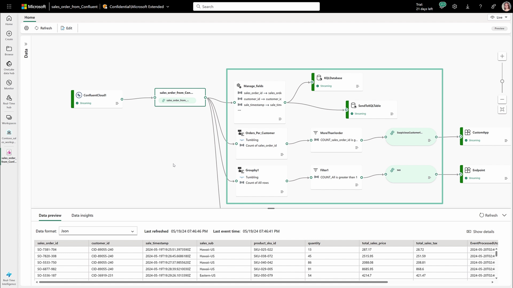

And in this case, I've done some aggregations, some filtering, and then ultimately used the new derived stream endpoint. 

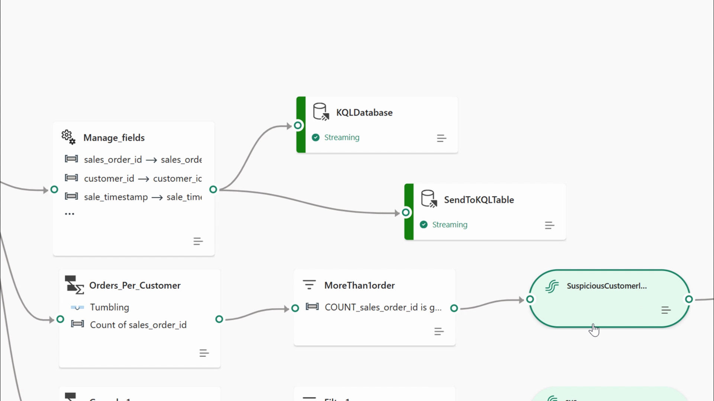

# CONCLUSION

What this does, is it takes the transformations I've already applied and published them back to the Real-Time hub so others can use that data without having to do the transformations themselves. 
